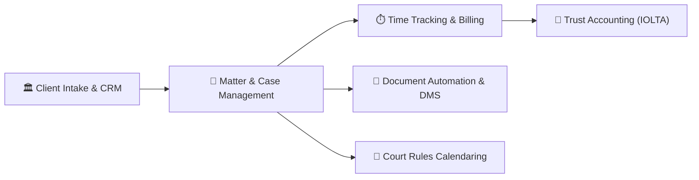

  

  
  
  
  
  
  
  

---

# ⚖️ Awesome Legal Practice Management (LPM)

> 🚀 **The premier curated guide to Legal Practice Management Software (LPMS)** — comparing top commercial cloud **SaaS platforms** with valuations, verified starting prices, and free trial limits alongside battle-tested **open-source GitHub repositories** ranked by stars.

Whether you run a solo law office, manage a high-volume boutique litigation firm, advise legal aid clinics, or architect legal tech AI solutions, **Legal Practice Management Software (LPMS)** serves as the operational operating system of the legal profession. These platforms orchestrate client intake (CRM), conflict-of-interest checks, case and matter management, legal document automation, court calendaring with statutory rules, timekeeping, LEDES billing, and bar-compliant **IOLTA trust accounting**.

---

## 📑 Table of Contents

- [🌟 Market Overview & Industry Dynamics](#-market-overview--industry-dynamics)
- [🏛️ Top Commercial SaaS Platforms](#️-top-commercial-saas-platforms)
- [💻 Open-Source GitHub Projects (Ranked by Stars)](#-open-source-github-projects-ranked-by-stars)
- [🏗️ Key Functional Pillars of LPMS](#️-key-functional-pillars-of-lpms)
- [🔍 Law Firm Evaluation & Buying Checklist](#-law-firm-evaluation--buying-checklist)
- [❓ Frequently Asked Questions (FAQ)](#-frequently-asked-questions-faq)
- [🤝 How to Contribute](#-how-to-contribute)
- [💖 Support & Sponsoring](#-support--sponsoring)
- [📈 Star History](#-star-history)
- [📜 Disclaimer & Ethical Notice](#-disclaimer--ethical-notice)

---

## 🌟 Market Overview & Industry Dynamics

> 📊 **Market Size & Structure Analysis:** The global Legal Practice Management Software (LPMS) market is estimated at **$2.7B – $3.1B** in 2025–2026 and is projected to expand at a Compound Annual Growth Rate (CAGR) of **10% to 12%**, reaching between **$5.0B and $7.5B** by the early 2030s. The sector is **moderately fragmented** rather than a winner-take-all monopoly: the top 10 market providers account for approximately 24% of total market revenue. This structure balances broad all-in-one platform consolidators (such as Clio and Filevine) against focused practice-area champions (such as CASEpeer for personal injury and CosmoLex for compliance accounting).

---

## 🏛️ Top Commercial SaaS Platforms

Below is an exhaustive comparison of the category-leading commercial Legal Practice Management SaaS platforms. To assist legal tech buyers and managing partners, the table includes verified corporate scale (valuation and annual recurring revenue), explicit starting tier prices, and exact free trial / free tier terms.

*Note: Table is sorted in **descending order** by company scale (Valuation / ARR).*

| 🏢 Platform | 💰 Company Scale (Valuation / ARR) | 🏷️ Starting Tier Pricing | 🆓 Free Tier / Trial Limits | 🎯 Core Specialization & Key Features |
| :--- | :--- | :--- | :--- | :--- |
| **[Clio](https://www.clio.com/)** | **$5.0B Valuation** *(Surpassed $500M ARR in 2026; Series G funded)* | **$49 / user / month** *(Starter tier; $39/user/mo billed annually)* | **7-day free trial** *(Full access to Clio Manage, up to 10 users, no credit card required)* | Industry benchmark for cloud LPMS; 250+ app marketplace integrations, Clio Payments (LawPay alternative), Clio Grow intake CRM, and Clio Duo generative AI. |
| **[Filevine](https://www.filevine.com/)** | **$3.0B Valuation** *(~$200M–$250M ARR; $400M Series E in 2025)* | **$49 / user / month** *(Starting core case management module; custom workflow tiers)* | **Free tier for LOIS AI** *(no CC required for legal AI drafting)* + **30-day free trial for Vinesign** *(Core suite requires custom demo)* | Enterprise litigation, mass torts, and complex personal injury; LOIS generative legal AI, customizable task chains, OCR search, and Vinesign e-signatures. |
| **[MyCase](https://www.mycase.com/)** *(AffiniPay / 8am)* | **~$1.5B Group Valuation** *(~$168M ARR; backed by TA Associates)* | **$49 / user / month** *(Basic plan; $39/user/mo billed annually or $60/mo monthly)* | **10-day free trial** *(Unrestricted access to all Pro features, client portal, and document management; no credit card required)* | Leading platform for solo and small law firms; built-in two-way SMS, client portal, LawPay payment processing integration, lead intake forms, and automated invoice reminders. |
| **[LEAP Legal Software](https://www.leaplegalsoftware.com/)** | **$1.0B+ Valuation (Unicorn)** *(~$180M–$220M Revenue; 60,000+ legal users across US, UK, AU, CA)* | **$149 / user / month** *(Standard practitioner license; annual contract agreement)* | **45-minute live interactive workflow demo** *(Personalized firm data model demo; custom pilot sandboxes provisioned post-consultation)* | Deep practice-area productivity; extensive automated legal document and court form library, integrated legal office accounting, LawY legal AI, and mobile apps. |
| **[CosmoLex](https://www.cosmolex.com/)** *(ProfitSolv)* | **~$500M Group Valuation** *(~$65M ARR legal software group; Lightyear Capital backed)* | **$99 / user / month** *(Billed annually at $99/user/mo or $109/user/mo monthly)* | **10-day free trial** *(Full access to matter management, billing, and trust accounting; limited to 1 live bank feed connection, no CC required)* | Complete end-to-end legal accounting; includes built-in general ledger and compliant IOLTA trust accounting, eliminating the need for external QuickBooks integration. |
| **[Actionstep](https://www.actionstep.com/)** | **~$250M–$350M Valuation** *(~$35M–$45M ARR; backed by Serent Capital)* | **$89 / user / month** *(Standard workflow tier; billed annually)* | **14-day assisted proof-of-concept sandbox** *(Configured by solutions engineer following initial discovery session; no self-serve free tier)* | Highly customizable workflow automation for mid-market law firms; front-to-back office integration, matter milestone tracking, Soluno accounting integration, and open API. |
| **[Smokeball](https://www.smokeball.com/)** | **~$150M–$200M Valuation** *(~$25M–$30M ARR; $30M growth capital raised)* | **$49 / user / month** *(Bill tier at $49/mo; Boost at $99/mo, Grow at $149/mo; annual agreement)* | **14-day free trial** *(Includes sample matters and automated time tracking upon sales demo activation; no permanent free plan)* | Automatic activity-based passive time tracking; deep Microsoft Word and Outlook integration, pre-loaded jurisdiction-specific legal forms, and matter-stage workflows. |
| **[Amicus Attorney](https://www.amicusattorney.com/)** *(CARET / CARET Legal)* | **~$120M–$160M Group Valuation** *(~$41M ARR; backed by Thomas H. Lee Partners)* | **$49 / user / month** *(Amicus Cloud at $49/user/mo; CARET Legal Enterprise at $79/user/mo)* | **7-day free trial (Amicus Cloud)** / **10-day free trial (CARET Legal)** *(Full calendar rules and matter management access, no credit card required)* | Established hybrid desktop/cloud legal management; advanced court rules calendaring, conflict checking, time/billing tracking, and native dual-entry accounting in CARET Legal. |
| **[PracticePanther](https://www.practicepanther.com/)** *(ASG / Alpine)* | **~$80M–$120M Valuation** *(~$16M ARR; Alpine Investors portfolio)* | **$49 / user / month** *(Solo tier billed annually at $49/user/mo or $59/user/mo monthly)* | **7-day free trial** *(Full feature access to PantherPayments, timers, custom intake forms, and client portal, no credit card required)* | Intuitive, user-friendly interface with fast onboarding; PantherPayments e-signature, customizable intake pipelines, trust accounting, and real-time automated billing alerts. |
| **[CASEpeer](https://www.casepeer.com/)** *(AffiniPay / 8am)* | **~$40M–$60M Division Value** *(~$5M–$10M ARR; AffiniPay group)* | **$79 / user / month** *(Basic plan at $79/user/mo; Pro plan at $119/user/mo)* | **7-day guided sandbox pilot** *(Tailored personal injury trial environment provided after workflow consultation; no permanent free tier)* | Dedicated case management purpose-built for personal injury plaintiffs; medical treatment tracking, settlement negotiation calculators, insurance lien management, and litigation tasking. |

---

## 💻 Open-Source GitHub Projects (Ranked by Stars)

While enterprise legal practice management is predominantly commercial SaaS due to strict statutory compliance and banking integrations, open-source software plays a crucial role in legal aid clinics, self-hosted privacy-first law firms, academic legal engineering, and specialized document automation.

*Note: The list below is sorted in **descending order** by GitHub star count. Each badge links directly to the repository's stargazers page.*

- **[open-legal-products/mike](https://github.com/open-legal-products/mike)**   
  🤖 *Next-generation Open-Source Legal AI Platform.* Designed to equip attorneys and legal engineers with self-hosted generative AI pipelines for contract parsing, legal document summarization, semantic search across litigation briefs, and local LLM orchestration with zero cloud data leakage.

- **[Open-Source-Legal/OpenContracts](https://github.com/Open-Source-Legal/OpenContracts)**   
  📄 *Enterprise Open Document Intelligence & Management Platform.* A complete DMS for modern legal practitioners and developers featuring document annotation, PDF layout analysis, semantic vector search, version control, and multi-model LLM integration for automated contract analysis.

- **[freelawproject/courtlistener](https://github.com/freelawproject/courtlistener)**   
  🏛️ *Searchable Archive of Legal Data, Opinions, & Court Dockets.* Built and maintained by the Free Law Project, CourtListener indexes hundreds of millions of federal and state legal opinions, RECAP PACER documents, oral argument audio recordings, judge disclosure records, and real-time court docket alerts.

- **[jhpyle/docassemble](https://github.com/jhpyle/docassemble)**   
  📝 *Free, Open-Source Expert System for Guided Interviews & Document Assembly.* Built with Python, YAML, and Markdown, Docassemble powers guided legal interviews that automatically generate complex PDF and DOCX legal forms, contracts, and court pleadings. Widely adopted across legal aid and court systems globally.

- **[freelawproject/juriscraper](https://github.com/freelawproject/juriscraper)**   
  🕷️ *Python Scraper Engine for American Court Websites & Decisions.* An open-source scraping library and API engine that systematically monitors, downloads, and structures court opinions, oral arguments, and docket sheets from appellate and federal courts across the United States.

- **[AnttiHero/lavern](https://github.com/AnttiHero/lavern)**   
  👥 *Agentic Law Firm Framework Powered by 67 Specialist AI Agents.* An Apache 2.0 open-source framework organizing collaborative AI subagents that simulate full-firm workflows: evidence-backed contract debate, conflict identification, compliance gates, and a 10-pass verification loop for attorney work product review.

- **[lawflow-boop/LawLink](https://github.com/lawflow-boop/LawLink)**   
  ⚖️ *Open-Source Self-Hosted Legal Practice Management System.* Specifically built for independent solo practitioners and small law firms seeking complete data ownership. Features matter lifecycle management, client intake, conflict-of-interest searching, basic finance tracking, and document archiving.

- **[jlawyerorg/j-lawyer-org](https://github.com/jlawyerorg/j-lawyer-org)**   
  🖥️ *Production-Grade Desktop & Server Case Management Suite.* Cross-platform (Windows, macOS, Linux) open-source software actively maintained for legal practices. Includes contact management, matter folders, calendaring, encrypted document management, scanning integrations, and beA (special electronic lawyer mailbox) interoperability.

- **[SuffolkLITLab/docassemble-AssemblyLine](https://github.com/SuffolkLITLab/docassemble-AssemblyLine)**   
  ⚡ *Rapid Court Form to Guided Web Application Engine.* Developed by Suffolk University's Legal Innovation & Technology Lab, this framework enables rapid conversion of standard paper court forms into fully accessible, multi-lingual, responsive mobile web intake interviews.

- **[chen-friedman/awesome-legaltech](https://github.com/chen-friedman/awesome-legaltech)**   
  📚 *Curated Open-Source Legal AI & LegalTech Index.* A comprehensive global directory indexing open-source legal AI tools, jurisdiction-tagged datasets, legal NLP benchmarks, and developer resources for building modern legal software.

- **[derekgan08/CaseAce-law-firm-management-system-backend](https://github.com/derekgan08/CaseAce-law-firm-management-system-backend)**   
  🛠️ *Node.js & Express REST Backend for Law Firm Operations.* Web backend providing structured endpoints for case dossier management, staff task assignments, attorney scheduling, client record keeping, and document metadata indexing.

- **[aworley/ocm](https://github.com/aworley/ocm)**   
  🏥 *Open Case Management (OCM) for Legal Aid & Nonprofits.* A browser-based open-source case management system (GPL) tailored specifically for not-for-profit legal service providers, public defense clinics, and community advocacy organizations.

- **[4csolutions/casecentral](https://github.com/4csolutions/casecentral)**   
  📂 *Open-Source Legal Practice Management Application.* Community project addressing standard law firm operational requirements, focusing on case tracking, task management, document linkage, and practitioner notes.

- **[vikash0439/legalSystem](https://github.com/vikash0439/legalSystem)**   
  ☕ *Spring Boot & MySQL Legal Case Tracking System.* A full-stack Java application delivering core law practice features: client registries, case status pipelines, hearing date reminders, and matter document storage.

- **[daniel-debrun/LegalNexus](https://github.com/daniel-debrun/LegalNexus)**   
  🔬 *AI-Powered Legal Research & Case Workspace.* Python-driven tool featuring isolated matter data architectures, CanLII case law lookup integration, and automated semantic relevance scoring for legal briefs.

- **[tolgatasci/lawyer-portal](https://github.com/tolgatasci/lawyer-portal)**   
  🌐 *Modern Full-Stack Legal Tech Portal (Laravel 10 + Vue 3).* Multi-tenant web platform for law firms incorporating case management, client CRM, automated legal document drafting, hearing scheduling, and responsive administrative dashboards.

- **[mlutfy/lcm](https://github.com/mlutfy/lcm)**   
  📋 *Legal Case Management for Advice Clinics.* Lightweight PHP/MySQL database system created for legal advice centers to record client consultations, track court hearings, and generate funding compliance reports.

---

## 🏗️ Key Functional Pillars of LPMS

Modern legal practices depend on software that addresses five foundational functional pillars:

1. **Client Intake & Lead CRM:** Captures leads from firm websites, sends automated conflict-of-interest checks across existing contact databases, and provides electronic intake questionnaires with digital signatures.
2. **Matter & Case Centralization:** Unifies docket numbers, assigned attorneys, court jurisdictions, opposing counsel details, and chronological activity timelines in a single pane of glass.
3. **Timekeeping & LEDES Billing:** Enables passive background time tracking, one-click mobile timers, UTBMS/LEDES 1998B electronic invoicing export, and PCI-compliant online card/eCheck processing.
4. **IOLTA Trust Accounting:** Implements strict three-way reconciliation (bank balance, general ledger, and individual client trust ledger balances) to protect firms from catastrophic state bar disciplinary actions.
5. **Document Automation & Court Calendaring:** Combines standardized merge templates (transforming matters into pleadings in seconds) with algorithmic court deadline calculation based on local court rules.

---

## 🔍 Law Firm Evaluation & Buying Checklist

When assessing Legal Practice Management solutions, law firm partners and IT directors should evaluate the following criteria:

| Evaluation Dimension | Crucial Considerations |
| :--- | :--- |
| **Trust Accounting (IOLTA)** | Does the platform natively handle three-way trust reconciliation and prevent unearned trust account overdrafts, or does it require external accounting software? |
| **Data Residency & Security** | Is data encrypted at rest (AES-256) and in transit (TLS 1.3)? Can you export complete firm relational databases upon contract termination? |
| **Court Rules Calendaring** | Does the system feature automated rule-based deadline calculation (e.g., LawToolBox) that recalculates trial dates when a trial date is rescheduled? |
| **Mobile Accessibility** | Does the platform offer full-featured iOS and Android native apps for capturing billable time, dictating notes, and viewing case dockets on the go? |
| **API & Integrations** | Does it provide a documented REST/GraphQL API for integration with Microsoft 365, Google Workspace, Zapier, and custom legal AI sidecars? |
| **Pricing Transparency** | Does the vendor charge additional fees for payment processing, SMS messaging, storage tiers, or document e-signatures? |

---

## ❓ Frequently Asked Questions (FAQ)

### What is the difference between Legal Practice Management and generic CRM/ERP?
Legal Practice Management systems are built specifically around the attorney-client privilege and statutory bar rules. Unlike Salesforce or HubSpot, LPMS includes mandatory conflict-of-interest cross-checking, LEDES 1998B billing formats, matter-centric document storage, court rule deadline calculations, and bar-mandated IOLTA trust accounting rules.

### Can a law firm rely entirely on open-source LPMS?
Yes, solo practitioners, legal aid clinics, and boutique firms can run effectively on open-source tools like **j-lawyer.org** or **LawLink**, especially when paired with **Docassemble** for document generation and self-hosted Nextcloud for storage. However, commercial SaaS remains dominant for firms requiring automated credit card processing, certified three-way trust accounting audits, and turnkey court calendaring integrations.

### How do Clio, MyCase, and PracticePanther differ?
- **Clio** has the largest ecosystem with over 250 third-party integrations, strong enterprise appeal, and dedicated generative AI tooling (Clio Duo).
- **MyCase** excels in solo and small-firm simplicity, offering integrated two-way SMS, seamless LawPay integration, and built-in client communication portals.
- **PracticePanther** is renowned for intuitive UI design, rapid onboarding, and robust automated workflow triggers for mid-sized practices.

---

## 🤝 How to Contribute

Contributions from legal practitioners, paralegals, legal tech engineers, and open-source advocates are warmly welcomed!

1. **Fork the repository** on GitHub.
2. **Create a descriptive feature branch**: `git checkout -b feature/add-new-legal-tool`
3. **Add or update an entry**:
   - For **SaaS platforms**, ensure starting pricing, free trial terms, and company scale metrics are thoroughly researched and verified.
   - For **Open-Source tools**, add the social white star badge linking to the repository's stargazers page and insert it into the star-sorted hierarchy.
4. **Commit your changes**: `git commit -m "Add [Tool Name] with verified pricing and features"`
5. **Open a Pull Request** with a concise explanation of the added tool and its relevance to legal practice management.

---

## 💖 Support & Sponsoring

Thank you for utilizing and supporting **Awesome Legal Practice Management**! ⚖️

Curating, researching, and continuously updating comprehensive benchmarks for legal tech platforms requires significant time and community dedication. If this repository has assisted your firm in evaluating software, discovering open-source alternatives, or architecting legal tech workflows, please consider supporting the project:

- ⭐ **Star this repository** on GitHub to amplify its reach across the legal tech and legal engineering communities.
- 🍴 **Fork and share** this resource with law partners, bar association committees, and legal tech builders.
- 📢 **Follow the author** on GitHub: [@ishandutta2007](https://github.com/ishandutta2007)
- ☕ **Buy me a coffee / Sponsor**: Support continuous maintenance and legal tech research directly via the [GitHub Sponsor Dashboard](https://github.com/sponsors/ishandutta2007).

---

## 📈 Star History

---

## 📜 Disclaimer & Ethical Notice

- This repository is a **community-curated index** published for informational, educational, and workflow evaluation purposes only. Inclusion does not constitute a commercial endorsement or legal advice.
- Legal Practice Management software handles confidential client data, protected health information (PHI), and strict financial trust accounts. Practicing attorneys remain personally responsible under Model Rules of Professional Conduct (including Rule 1.1 Competence, Rule 1.6 Confidentiality, and Rule 1.15 Safekeeping Property) for evaluating security, encryption, data backup, and jurisdictional compliance.

---

  <b>Curated with ⚖️ by <a href="https://github.com/ishandutta2007">Ishan Dutta</a> and the Legal Tech Community</b> 
  Part of the <a href="https://github.com/ishandutta2007/Awesome-Awesome-Awesome">Awesome-Awesome-Awesome</a> collection.

